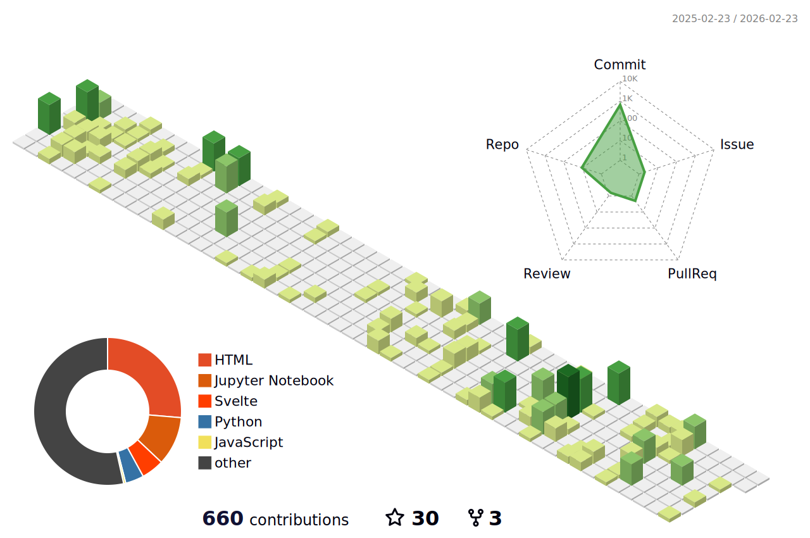
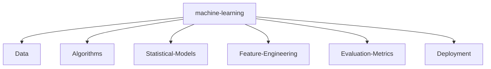

<!--   my-icons -->

<p align="center">
    <a href="https://github.com/Hydraallen/Hydraallen"></a>
    <a href="https://github.com/python/cpython"></a>
    <a href="https://github.com/Hydraallen/Hydraallen/graphs/contributors"></a>
    <a href="https://github.com/Hydraallen/Hydraallen/stargazers"></a>
    <a href="https://github.com/BEPb/BEPb/network/members"></a>
       
</p>
<!--   my-header-img -->

<a href="https://www.python.org/"></a>


<!--   my-ticker -->    
[](https://git.io/typing-svg)


<!--   my-skils -->

| Property                                        | Data                                                         |
| ----------------------------------------------- | ------------------------------------------------------------ |
| **Language / IDE**                              |   |
| **Domain Knownledge**                           | [](https://github.com/search?q=user%3ABEPb&type=Repositories) [](https://github.com/search?q=user%3ABEPb&type=Repositories) |
| **CI / CD**                                     | [](https://github.com/BEPb/BEPb) [](https://github.com/BEPb/BEPb) [](https://github.com/BEPb/BEPb) |
| **OS**                                          |     |
| **Terminal**                                          |  |


<!--   GitHub stats graph -->
### 📈 GitHub Activity Graph:
<!-- [](https://github.com/BEPb/github-readme-activity-graph) -->

| .                                                                                                                                       | .                                                                                                                         |
|-----------------------------------------------------------------------------------------------------------------------------------------|---------------------------------------------------------------------------------------------------------------------------|
|  |  |

</img>

<!--   profile-green-animate -->


<!--   grid-snake -->


<!--   skyline 
<a href="https://skyline.github.com/BEPb/2022"></a>
-->

<!--  2d history skills -->
</img>

**📫 How to Reach me:**
<p align="left">
<a href="https://twitter.com/noname85071193" target="blank"></a>
<a href="https://linkedin.com/in/andrej-marinchenko-0445b7214" target="blank"></a>
<a href="mailto:andrej.marinchenko@gmail.com" target="blank"></a>
<a href="https://api.whatsapp.com/send?phone=+375333333355" alt="Connect on Whatsapp">  </a>
</p>

<div align="center">
<summary>Trophy: Github Profile Trophy</summary>
</div>

<p align="center"> 
<a href="https://github.com/ryo-ma/github-profile-trophy"></a>
</p>


   <!--machine-learning-->


 


<div align="center">
<summary>Trophy: Hackerrank Profile Trophy</summary>
</div>

<p align="center"> 

 

</p>


<!-- Belarus - My Home-->

 ```geojson
{
 "type": "FeatureCollection",
 "features": [
   {
     "type": "Feature",
     "id": 1,
     "properties": {
       "ID": 0
     },
     "geometry": {
       "type": "Polygon",
       "coordinates": [
         [
             [23.5,53.9],
             [32.6,52.6]
         ]
       ]
     }
   }
 ]
}

 ```


<p align="center"> 


</p>


#### Thanks for visiting :heart:

<p align="center"> 
  

counting of visitors to this page in this section started from May 8, 2022
<a href="http://s01.flagcounter.com/more/ap7"></a>


## Star History

[](https://star-history.com/#BEPb/BEPb&Date)


### Profile Views
counting of visitors to this page in this section started from June 12, 2022


</br>

[MIT](LICENSE)


</p>

---
  *If you liked my profile, you can Star ⭐ the repo and if you want to use this template you can Fork it and can use.* 
---
Would you ike to meet me?

If you want to contribute to any of my repositories, feel free to submit PRs, issues and email me. Pick a slot if you'd like to meet me and chat about proposals and ideas - but make sure to describe the agenda

---
  *I use an automatic subscription control system. Thus, everyone who subscribes to me, I will subscribe to those and I will respond, and vice versa, I will remove all those who unsubscribe from me from among those who should be followed.* 
---


