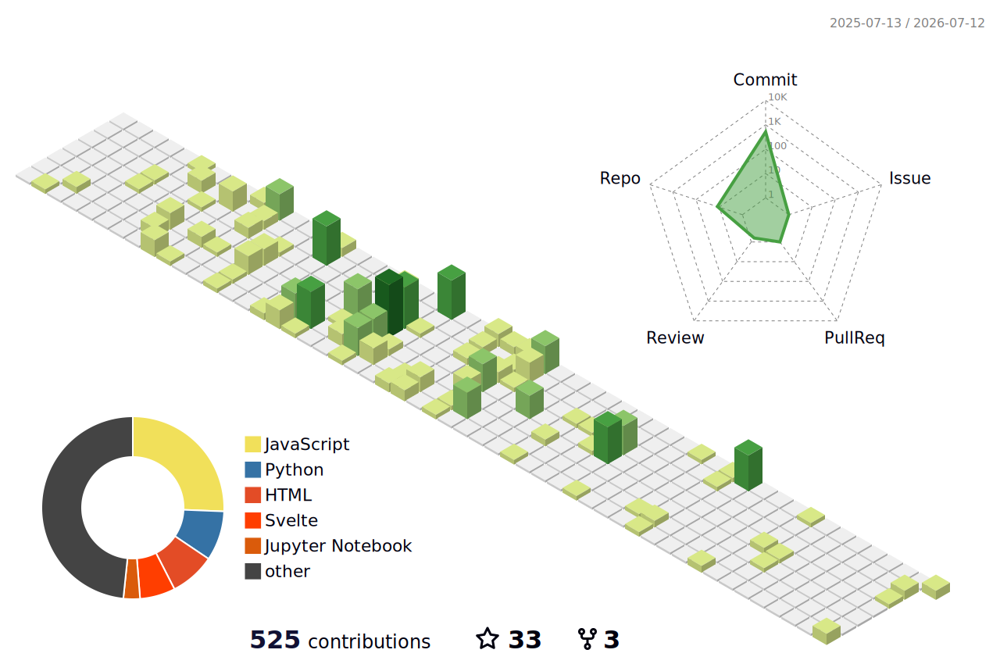

<!--   my-icons -->

<p align="center">
    <a href="https://github.com/Hydraallen/Hydraallen"></a>
    <a href="https://github.com/Hydraallen/Hydraallen/graphs/contributors"></a>
</p>

<!--   my-header-img -->

<a href="https://www.python.org/"></a>


<!--   my-ticker -->    
[](https://git.io/typing-svg)


<!--   my-skils -->

| Property                                        | Data                                                         |
| ----------------------------------------------- | ------------------------------------------------------------ |
| **Language / IDE**                              |            |
| **Domain Knownledge**                           | [](https://github.com/search?q=user%3ABEPb&type=Repositories) [](https://github.com/search?q=user%3ABEPb&type=Repositories) |
| **CI / CD**                                     | [](https://github.com/BEPb/BEPb) [](https://github.com/BEPb/BEPb) [](https://github.com/BEPb/BEPb) |
| **OS**                                          |     |
| **Terminal**                                          |  |

[My Blog](https://hydraallen.github.io/)

My repositories:

- [My lunarvim config](https://github.com/Hydraallen/lvim)
- [My Rime config](https://github.com/Hydraallen/Rime)
- [Vim Workshop](https://github.com/Hydraallen/Vim_wksp_2023)
- [Git Workshop](https://github.com/Hydraallen/Basic_Git_wksp)
- [VSCode Workshop](https://github.com/Hydraallen/VSCode_wksp)
- [Use Latex with VSCode](https://github.com/Hydraallen/Latex-vscode)
- [Joint-online-judge(JOJ3)](https://github.com/Hydraallen/JOJ3)
- [hammerspoon](https://github.com/Hydraallen/hammerspoon)
- [bat tutorial](https://github.com/Hydraallen/bat)
- [Manjaro guidence](https://github.com/Hydraallen/Manjaro)
- [A simple face recognition test](https://github.com/Hydraallen/Face-recognition)
- [yabai(no updating)](https://github.com/Hydraallen/yabai_Usage)
- [Small cooking game chinese version](https://github.com/Hydraallen/CookingGame)


<!--   GitHub stats graph -->
### 📈 GitHub Activity Graph:

<table>
  <tr>
    <td valign="top" width="50%">
      
    </td>
    <td valign="top" width="50%">
      
    </td>
  </tr>
</table>


<!--   profile-green-animate -->



<!--   grid-snake -->


<!--START_SECTION:waka-->


**🐱 My GitHub Data** 

> 📦 4.6 MB Used in GitHub's Storage 
 > 
> 🏆 207 Contributions in the Year 2026
 > 
> 🚫 Not Opted to Hire
 > 
> 📜 36 Public Repositories 
 > 
> 🔑 15 Private Repositories 
 > 
**I'm a Night 🦉** 

```text
🌞 Morning                151096 commits      ████████░░░░░░░░░░░░░░░░░   31.42 % 
🌆 Daytime                2720 commits        ░░░░░░░░░░░░░░░░░░░░░░░░░   00.57 % 
🌃 Evening                998 commits         ░░░░░░░░░░░░░░░░░░░░░░░░░   00.21 % 
🌙 Night                  326006 commits      █████████████████░░░░░░░░   67.80 % 
```
📅 **I'm Most Productive on Monday** 

```text
Monday                   470265 commits      ████████████████████████░   97.80 % 
Tuesday                  1047 commits        ░░░░░░░░░░░░░░░░░░░░░░░░░   00.22 % 
Wednesday                1009 commits        ░░░░░░░░░░░░░░░░░░░░░░░░░   00.21 % 
Thursday                 4166 commits        ░░░░░░░░░░░░░░░░░░░░░░░░░   00.87 % 
Friday                   869 commits         ░░░░░░░░░░░░░░░░░░░░░░░░░   00.18 % 
Saturday                 1006 commits        ░░░░░░░░░░░░░░░░░░░░░░░░░   00.21 % 
Sunday                   2458 commits        ░░░░░░░░░░░░░░░░░░░░░░░░░   00.51 % 
```


📊 **This Week I Spent My Time On** 

```text
🕑︎ Time Zone: Asia/Shanghai

💬 Programming Languages: 
Python                   19 hrs 48 mins      █████████████░░░░░░░░░░░░   52.27 % 
Markdown                 7 hrs 31 mins       █████░░░░░░░░░░░░░░░░░░░░   19.86 % 
TypeScript               5 hrs 21 mins       ████░░░░░░░░░░░░░░░░░░░░░   14.15 % 
TeX                      1 hr 30 mins        █░░░░░░░░░░░░░░░░░░░░░░░░   04.00 % 
JSON                     1 hr 30 mins        █░░░░░░░░░░░░░░░░░░░░░░░░   03.98 % 

🔥 Editors: 
Claude Code              35 hrs 57 mins      ████████████████████████░   94.88 % 
VS Code                  1 hr 51 mins        █░░░░░░░░░░░░░░░░░░░░░░░░   04.92 % 
Neovim                   4 mins              ░░░░░░░░░░░░░░░░░░░░░░░░░   00.20 % 

🐱‍💻 Projects: 
B127_Play_Galaxy         29 hrs 41 mins      ████████████████████░░░░░   78.33 % 
TripPlanner              4 hrs 5 mins        ███░░░░░░░░░░░░░░░░░░░░░░   10.79 % 
LaTeX英文模板（原创声明更新版）       1 hr 32 mins        █░░░░░░░░░░░░░░░░░░░░░░░░   04.06 % 
User-Simulator           48 mins             █░░░░░░░░░░░░░░░░░░░░░░░░   02.12 % 
ECE4500J                 37 mins             ░░░░░░░░░░░░░░░░░░░░░░░░░   01.66 % 

💻 Operating System: 
Linux                    20 hrs 51 mins      ██████████████░░░░░░░░░░░   55.03 % 
Mac                      17 hrs 2 mins       ███████████░░░░░░░░░░░░░░   44.97 % 
```

**I Mostly Code in Python** 

```text
Python                   10 repos            ██████░░░░░░░░░░░░░░░░░░░   23.26 % 
Jupyter Notebook         8 repos             █████░░░░░░░░░░░░░░░░░░░░   18.60 % 
JavaScript               6 repos             ███░░░░░░░░░░░░░░░░░░░░░░   13.95 % 
HTML                     3 repos             ██░░░░░░░░░░░░░░░░░░░░░░░   06.98 % 
Svelte                   1 repo              █░░░░░░░░░░░░░░░░░░░░░░░░   02.33 % 
```


 Last Updated on 18/07/2026 20:32:22 UTC
<!--END_SECTION:waka-->


**📫 How to Reach me:**

<p align="left">
<a href="mailto:wangruiallen@gmail.com" target="blank"></a>
<a href="https://www.linkedin.com/in/rui-wang-546099392/" target="blank"></a>
</p>


</p>


