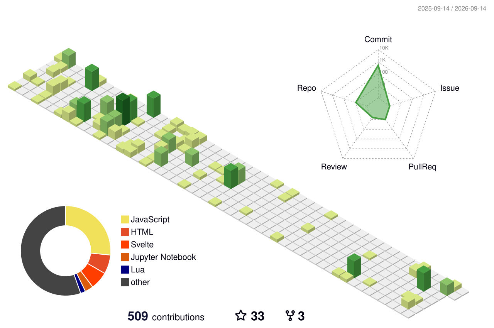

<!--   my-icons -->

<p align="center">
    <a href="https://github.com/Hydraallen/Hydraallen"></a>
    <a href="https://github.com/Hydraallen/Hydraallen/graphs/contributors"></a>
</p>

<!--   my-header-img -->

<a href="https://www.python.org/"></a>


<!--   my-ticker -->    
[](https://git.io/typing-svg)


<!--   my-skils -->

| Property                                        | Data                                                         |
| ----------------------------------------------- | ------------------------------------------------------------ |
| **Language / IDE**                              |            |
| **Domain Knownledge**                           | [](https://github.com/search?q=user%3ABEPb&type=Repositories) [](https://github.com/search?q=user%3ABEPb&type=Repositories) |
| **CI / CD**                                     | [](https://github.com/BEPb/BEPb) [](https://github.com/BEPb/BEPb) [](https://github.com/BEPb/BEPb) |
| **OS**                                          |     |
| **Terminal**                                          |  |

[My Blog](https://hydraallen.github.io/)

My repositories:

- [My lunarvim config](https://github.com/Hydraallen/lvim)
- [My Rime config](https://github.com/Hydraallen/Rime)
- [Vim Workshop](https://github.com/Hydraallen/Vim_wksp_2023)
- [Git Workshop](https://github.com/Hydraallen/Basic_Git_wksp)
- [VSCode Workshop](https://github.com/Hydraallen/VSCode_wksp)
- [Use Latex with VSCode](https://github.com/Hydraallen/Latex-vscode)
- [Joint-online-judge(JOJ3)](https://github.com/Hydraallen/JOJ3)
- [hammerspoon](https://github.com/Hydraallen/hammerspoon)
- [bat tutorial](https://github.com/Hydraallen/bat)
- [Manjaro guidence](https://github.com/Hydraallen/Manjaro)
- [A simple face recognition test](https://github.com/Hydraallen/Face-recognition)
- [yabai(no updating)](https://github.com/Hydraallen/yabai_Usage)
- [Small cooking game chinese version](https://github.com/Hydraallen/CookingGame)


<!--   GitHub stats graph -->
### 📈 GitHub Activity Graph:

<table>
  <tr>
    <td valign="top" width="50%">
      
    </td>
    <td valign="top" width="50%">
      
    </td>
  </tr>
</table>


<!--   profile-green-animate -->



<!--   grid-snake -->


<!--START_SECTION:waka-->


**🐱 My GitHub Data** 

> 📦 4.3 MB Used in GitHub's Storage 
 > 
> 🏆 266 Contributions in the Year 2026
 > 
> 🚫 Not Opted to Hire
 > 
> 📜 35 Public Repositories 
 > 
> 🔑 17 Private Repositories 
 > 
**I'm a Night 🦉** 

```text
🌞 Morning                151221 commits      ████████░░░░░░░░░░░░░░░░░   31.43 % 
🌆 Daytime                2846 commits        ░░░░░░░░░░░░░░░░░░░░░░░░░   00.59 % 
🌃 Evening                1094 commits        ░░░░░░░░░░░░░░░░░░░░░░░░░   00.23 % 
🌙 Night                  326039 commits      █████████████████░░░░░░░░   67.76 % 
```
📅 **I'm Most Productive on Monday** 

```text
Monday                   470082 commits      ████████████████████████░   97.69 % 
Tuesday                  1119 commits        ░░░░░░░░░░░░░░░░░░░░░░░░░   00.23 % 
Wednesday                1086 commits        ░░░░░░░░░░░░░░░░░░░░░░░░░   00.23 % 
Thursday                 4338 commits        ░░░░░░░░░░░░░░░░░░░░░░░░░   00.90 % 
Friday                   945 commits         ░░░░░░░░░░░░░░░░░░░░░░░░░   00.20 % 
Saturday                 1055 commits        ░░░░░░░░░░░░░░░░░░░░░░░░░   00.22 % 
Sunday                   2575 commits        ░░░░░░░░░░░░░░░░░░░░░░░░░   00.54 % 
```


📊 **This Week I Spent My Time On** 

```text
🕑︎ Time Zone: Asia/Shanghai

💬 Programming Languages: 
Markdown                 26 hrs 48 mins      ████████████████░░░░░░░░░   65.80 % 
Python                   7 hrs 42 mins       █████░░░░░░░░░░░░░░░░░░░░   18.92 % 
Bash                     3 hrs 5 mins        ██░░░░░░░░░░░░░░░░░░░░░░░   07.59 % 
Other                    1 hr 2 mins         █░░░░░░░░░░░░░░░░░░░░░░░░   02.55 % 
TeX                      1 hr 1 min          █░░░░░░░░░░░░░░░░░░░░░░░░   02.50 % 

🔥 Editors: 
VS Code                  24 hrs 24 mins      ███████████████░░░░░░░░░░   59.89 % 
Claude Code              8 hrs 33 mins       █████░░░░░░░░░░░░░░░░░░░░   21.00 % 
Codex Vscode             7 hrs 46 mins       █████░░░░░░░░░░░░░░░░░░░░   19.08 % 
Exec Wakatime            0 secs              ░░░░░░░░░░░░░░░░░░░░░░░░░   00.03 % 

🐱‍💻 Projects: 
TripPlanner              20 hrs 41 mins      █████████████░░░░░░░░░░░░   50.76 % 
代码复现                     8 hrs 52 mins       █████░░░░░░░░░░░░░░░░░░░░   21.76 % 
claude-code-config       4 hrs 45 mins       ███░░░░░░░░░░░░░░░░░░░░░░   11.66 % 
MyServers                3 hrs 9 mins        ██░░░░░░░░░░░░░░░░░░░░░░░   07.74 % 
cv                       1 hr 38 mins        █░░░░░░░░░░░░░░░░░░░░░░░░   04.02 % 

💻 Operating System: 
Mac                      40 hrs 45 mins      █████████████████████████   100.00 % 
```

🤖 **AI Coding This Week** 

```text
⏱ AI Coding Time: 40 hrs 41 mins (99.85%)

✍️ 25,826 lines written by AI, 32 lines written by hand (99.88% AI-written)

🔤 37,542,005 Input Tokens, 4,021,686 Output Tokens

💵 $1400.68 Estimated AI Cost This Week

🧠 70 AI Sessions, 542 AI Prompts

GPT                      12,319 lines        ████████████░░░░░░░░░░░░░   46.76 % 
Opus                     9,447 lines         █████████░░░░░░░░░░░░░░░░   35.86 % 
Glm                      4,533 lines         ████░░░░░░░░░░░░░░░░░░░░░   17.21 % 
Sonnet                   47 lines            ░░░░░░░░░░░░░░░░░░░░░░░░░   00.18 % 
Claude-Code              0 lines             ░░░░░░░░░░░░░░░░░░░░░░░░░   00.00 % 

🔎 AI Coding Insights:
🤖 AI-Driven — 99.88% of written lines came from AI
📚 Verbose Prompter — average 2,063 characters per prompt
🔁 Iterative Prompter — average 8 prompts per session
🚀 High AI Trust — 0.19% of changed lines were hand-edited
```

**I Mostly Code in Jupyter Notebook** 

```text
Jupyter Notebook         10 repos            █████░░░░░░░░░░░░░░░░░░░░   20.41 % 
Python                   10 repos            █████░░░░░░░░░░░░░░░░░░░░   20.41 % 
JavaScript               8 repos             ████░░░░░░░░░░░░░░░░░░░░░   16.33 % 
Lua                      3 repos             ██░░░░░░░░░░░░░░░░░░░░░░░   06.12 % 
TypeScript               2 repos             █░░░░░░░░░░░░░░░░░░░░░░░░   04.08 % 
```


 Last Updated on 19/08/2026 20:55:20 UTC
<!--END_SECTION:waka-->


**📫 How to Reach me:**

<p align="left">
<a href="mailto:wangruiallen@gmail.com" target="blank"></a>
<a href="https://www.linkedin.com/in/rui-wang-546099392/" target="blank"></a>
</p>


</p>


