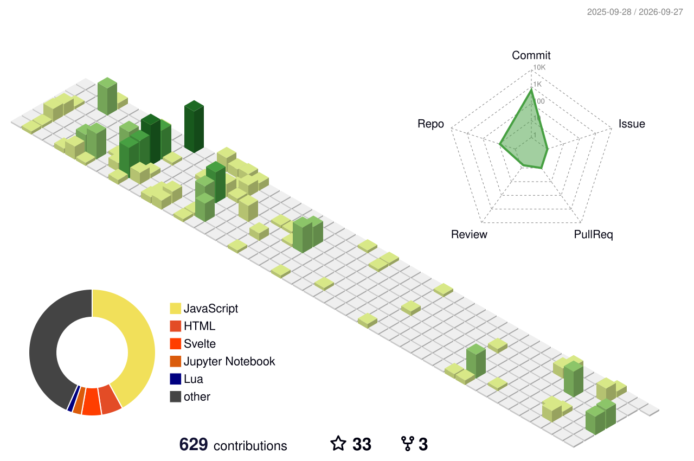

<!--   my-icons -->

<p align="center">
    <a href="https://github.com/Hydraallen/Hydraallen"></a>
    <a href="https://github.com/Hydraallen/Hydraallen/graphs/contributors"></a>
</p>

<!--   my-header-img -->

<a href="https://www.python.org/"></a>


<!--   my-ticker -->    
[](https://git.io/typing-svg)


<!--   my-skils -->

| Property                                        | Data                                                         |
| ----------------------------------------------- | ------------------------------------------------------------ |
| **Language / IDE**                              |                 |
| **Frameworks / ML**                             |          |
| **Domain Knowledge**                           | [](https://github.com/search?q=user%3AHydraallen&type=Repositories) [](https://github.com/search?q=user%3AHydraallen&type=Repositories)  [](https://github.com/search?q=user%3AHydraallen&type=Repositories) [](https://github.com/search?q=user%3AHydraallen&type=Repositories) [](https://github.com/search?q=user%3AHydraallen&type=Repositories) [](https://github.com/search?q=user%3AHydraallen&type=Repositories) [](https://github.com/search?q=user%3AHydraallen&type=Repositories) |
| **CI / CD**                                     | [](https://github.com/Hydraallen/Hydraallen) [](https://github.com/Hydraallen/Hydraallen) [](https://github.com/Hydraallen/Hydraallen)  [](https://github.com/Hydraallen/Hydraallen) [](https://github.com/Hydraallen/Hydraallen) [](https://github.com/Hydraallen/Hydraallen) [](https://github.com/Hydraallen/Hydraallen) |
| **OS**                                          |     |
| **Terminal**                                          |  |

[My Blog](https://hydraallen.github.io/)

My repositories:

- [My lunarvim config](https://github.com/Hydraallen/lvim)
- [My Rime config](https://github.com/Hydraallen/Rime)
- [Vim Workshop](https://github.com/Hydraallen/Vim_wksp_2023)
- [Git Workshop](https://github.com/Hydraallen/Basic_Git_wksp)
- [VSCode Workshop](https://github.com/Hydraallen/VSCode_wksp)
- [Use Latex with VSCode](https://github.com/Hydraallen/Latex-vscode)
- [Joint-online-judge(JOJ3)](https://github.com/Hydraallen/JOJ3)
- [hammerspoon](https://github.com/Hydraallen/hammerspoon)
- [bat tutorial](https://github.com/Hydraallen/bat)
- [Manjaro guidence](https://github.com/Hydraallen/Manjaro)
- [A simple face recognition test](https://github.com/Hydraallen/Face-recognition)
- [yabai(no updating)](https://github.com/Hydraallen/yabai_Usage)
- [Small cooking game chinese version](https://github.com/Hydraallen/CookingGame)


<!--   GitHub stats graph -->
### 📈 GitHub Activity Graph:

<table>
  <tr>
    <td valign="top" width="50%">
      
    </td>
    <td valign="top" width="50%">
      
    </td>
  </tr>
</table>


<!--   profile-green-animate -->



<!--   grid-snake -->


<!--START_SECTION:waka-->


**🐱 My GitHub Data** 

> 📦 4.4 MB Used in GitHub's Storage 
 > 
> 🏆 277 Contributions in the Year 2026
 > 
> 🚫 Not Opted to Hire
 > 
> 📜 34 Public Repositories 
 > 
> 🔑 16 Private Repositories 
 > 
**I'm a Night 🦉** 

```text
🌞 Morning                182457 commits      ██████░░░░░░░░░░░░░░░░░░░   24.81 % 
🌆 Daytime                4808 commits        ░░░░░░░░░░░░░░░░░░░░░░░░░   00.65 % 
🌃 Evening                2098 commits        ░░░░░░░░░░░░░░░░░░░░░░░░░   00.29 % 
🌙 Night                  546075 commits      ███████████████████░░░░░░   74.25 % 
```
📅 **I'm Most Productive on Monday** 

```text
Monday                   715830 commits      ████████████████████████░   97.33 % 
Tuesday                  2541 commits        ░░░░░░░░░░░░░░░░░░░░░░░░░   00.35 % 
Wednesday                1327 commits        ░░░░░░░░░░░░░░░░░░░░░░░░░   00.18 % 
Thursday                 10299 commits       ░░░░░░░░░░░░░░░░░░░░░░░░░   01.40 % 
Friday                   1110 commits        ░░░░░░░░░░░░░░░░░░░░░░░░░   00.15 % 
Saturday                 1501 commits        ░░░░░░░░░░░░░░░░░░░░░░░░░   00.20 % 
Sunday                   2830 commits        ░░░░░░░░░░░░░░░░░░░░░░░░░   00.38 % 
```


📊 **This Week I Spent My Time On** 

```text
🕑︎ Time Zone: Asia/Shanghai

💬 Programming Languages: 
Python                   22 hrs 11 mins      ████████████░░░░░░░░░░░░░   48.99 % 
Markdown                 11 hrs 12 mins      ██████░░░░░░░░░░░░░░░░░░░   24.75 % 
Other                    3 hrs 52 mins       ██░░░░░░░░░░░░░░░░░░░░░░░   08.54 % 
Text                     2 hrs 33 mins       █░░░░░░░░░░░░░░░░░░░░░░░░   05.63 % 
Bash                     1 hr 50 mins        █░░░░░░░░░░░░░░░░░░░░░░░░   04.06 % 

🔥 Editors: 
Claude Code              31 hrs 42 mins      ██████████████████░░░░░░░   70.01 % 
VS Code                  13 hrs 30 mins      ███████░░░░░░░░░░░░░░░░░░   29.84 % 
Neovim                   3 mins              ░░░░░░░░░░░░░░░░░░░░░░░░░   00.15 % 

💻 Operating System: 
Mac                      45 hrs 17 mins      █████████████████████████   100.00 % 
```

🤖 **AI Coding This Week** 

```text
⏱ AI Coding Time: 45 hrs 11 mins (99.78%)

✍️ 34,948 lines written by AI, 354 lines written by hand (99.0% AI-written)

🔤 48,966,856 Input Tokens, 6,525,837 Output Tokens

💵 $1015.19 Estimated AI Cost This Week

🧠 444 AI Sessions, 1019 AI Prompts

Opus                     32,920 lines        ███████████████████████░░   93.97 % 
Glm                      2,109 lines         ██░░░░░░░░░░░░░░░░░░░░░░░   06.02 % 
Fable                    2 lines             ░░░░░░░░░░░░░░░░░░░░░░░░░   00.01 % 
Sonnet                   0 lines             ░░░░░░░░░░░░░░░░░░░░░░░░░   00.00 % 
Claude-Code              0 lines             ░░░░░░░░░░░░░░░░░░░░░░░░░   00.00 % 

🔎 AI Coding Insights:
🤖 AI-Driven — 99.0% of written lines came from AI
📚 Verbose Prompter — average 12,304 characters per prompt
🔁 Iterative Prompter — average 2 prompts per session
🚀 High AI Trust — 1.06% of changed lines were hand-edited
```

**I Mostly Code in Jupyter Notebook** 

```text
Jupyter Notebook         10 repos            █████░░░░░░░░░░░░░░░░░░░░   20.00 % 
JavaScript               8 repos             ████░░░░░░░░░░░░░░░░░░░░░   16.00 % 
Python                   7 repos             ████░░░░░░░░░░░░░░░░░░░░░   14.00 % 
TypeScript               6 repos             ███░░░░░░░░░░░░░░░░░░░░░░   12.00 % 
Lua                      3 repos             ██░░░░░░░░░░░░░░░░░░░░░░░   06.00 % 
```


 Last Updated on 02/10/2026 23:50:36 UTC
<!--END_SECTION:waka-->


**📫 How to Reach me:**

<p align="left">
<a href="mailto:wangruiallen@gmail.com" target="blank"></a>
<a href="https://www.linkedin.com/in/rui-wang-546099392/" target="blank"></a>
</p>


