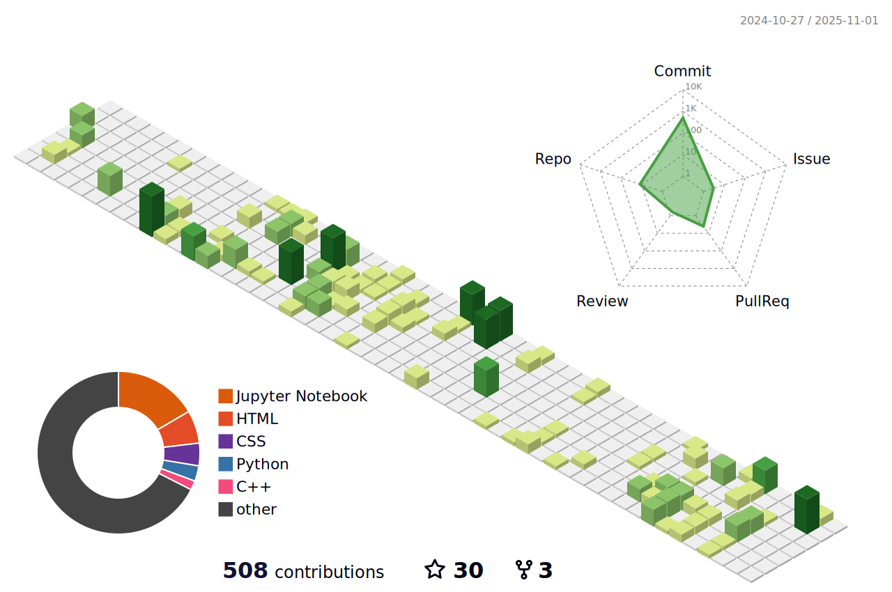

<!--   my-icons -->

<p align="center">
    <a href="https://github.com/Hydraallen/Hydraallen"></a>
    <a href="https://github.com/Hydraallen/Hydraallen/graphs/contributors"></a>
       
</p>

<!--   my-header-img -->

<a href="https://www.python.org/"></a>


<!--   my-ticker -->    
[](https://git.io/typing-svg)


<!--   my-skils -->

| Property                                        | Data                                                         |
| ----------------------------------------------- | ------------------------------------------------------------ |
| **Language / IDE**                              |            |
| **Domain Knownledge**                           | [](https://github.com/search?q=user%3ABEPb&type=Repositories) [](https://github.com/search?q=user%3ABEPb&type=Repositories) |
| **CI / CD**                                     | [](https://github.com/BEPb/BEPb) [](https://github.com/BEPb/BEPb) [](https://github.com/BEPb/BEPb) |
| **OS**                                          |     |
| **Terminal**                                          |  |

[My Blog](https://hydraallen.github.io/)

My repositories:

- [My lunarvim config](https://github.com/Hydraallen/lvim)
- [Vim Workshop](https://github.com/Hydraallen/Vim-Workshop)
- [Git Workshop](https://github.com/Hydraallen/Basic_Git_wksp)
- [VSCode Workshop](https://github.com/Hydraallen/VSCode_wksp)
- [Use Latex with VSCode](https://github.com/Hydraallen/Latex-vscode)
- [hammerspoon](https://github.com/Hydraallen/hammerspoon)
- [kitty tutorial](https://github.com/Hydraallen/kitty)
- [bat tutorial](https://github.com/Hydraallen/bat)
- [Manjaro guidence](https://github.com/Hydraallen/Manjaro)
- [A simple face recognition test](https://github.com/Hydraallen/Face-recognition)
- [yolov5 model training](https://github.com/Hydraallen/yolov5)
- [yabai(no updating)](https://github.com/Hydraallen/yabai_Usage)
- [Small cooking game chinese version](https://github.com/Hydraallen/CookingGame)


<!--   GitHub stats graph -->
### 📈 GitHub Activity Graph:


| .                                                                                                                                       | .                                                                                                                         |
|-----------------------------------------------------------------------------------------------------------------------------------------|---------------------------------------------------------------------------------------------------------------------------|
|  |  |


<!--   profile-green-animate -->



<!--   grid-snake -->


<!--START_SECTION:waka-->


**🐱 My GitHub Data** 

> 📦 3.5 MB Used in GitHub's Storage 
 > 
> 🏆 306 Contributions in the Year 2024
 > 
> 🚫 Not Opted to Hire
 > 
> 📜 25 Public Repositories 
 > 
> 🔑 13 Private Repositories 
 > 
**I'm a Night 🦉** 

```text
🌞 Morning                157 commits         ████░░░░░░░░░░░░░░░░░░░░░   14.20 % 
🌆 Daytime                311 commits         ███████░░░░░░░░░░░░░░░░░░   28.12 % 
🌃 Evening                510 commits         ████████████░░░░░░░░░░░░░   46.11 % 
🌙 Night                  128 commits         ███░░░░░░░░░░░░░░░░░░░░░░   11.57 % 
```
📅 **I'm Most Productive on Saturday** 

```text
Monday                   140 commits         ███░░░░░░░░░░░░░░░░░░░░░░   12.66 % 
Tuesday                  105 commits         ██░░░░░░░░░░░░░░░░░░░░░░░   09.49 % 
Wednesday                137 commits         ███░░░░░░░░░░░░░░░░░░░░░░   12.39 % 
Thursday                 187 commits         ████░░░░░░░░░░░░░░░░░░░░░   16.91 % 
Friday                   196 commits         ████░░░░░░░░░░░░░░░░░░░░░   17.72 % 
Saturday                 217 commits         █████░░░░░░░░░░░░░░░░░░░░   19.62 % 
Sunday                   124 commits         ███░░░░░░░░░░░░░░░░░░░░░░   11.21 % 
```


📊 **This Week I Spent My Time On** 

```text
🕑︎ Time Zone: Asia/Shanghai

💬 Programming Languages: 
Python                   8 hrs 43 mins       ███████░░░░░░░░░░░░░░░░░░   27.64 % 
V                        8 hrs 34 mins       ███████░░░░░░░░░░░░░░░░░░   27.16 % 
C++                      6 hrs 54 mins       █████░░░░░░░░░░░░░░░░░░░░   21.87 % 
HTML                     2 hrs 16 mins       ██░░░░░░░░░░░░░░░░░░░░░░░   07.21 % 
Text                     48 mins             █░░░░░░░░░░░░░░░░░░░░░░░░   02.59 % 

🔥 Editors: 
VS Code                  25 hrs 41 mins      ████████████████████░░░░░   81.45 % 
Neovim                   5 hrs 44 mins       █████░░░░░░░░░░░░░░░░░░░░   18.19 % 
Vim                      6 mins              ░░░░░░░░░░░░░░░░░░░░░░░░░   00.37 % 

🐱‍💻 Projects: 
Lab4                     9 hrs 42 mins       ████████░░░░░░░░░░░░░░░░░   30.76 % 
Unknown Project          3 hrs 58 mins       ███░░░░░░░░░░░░░░░░░░░░░░   12.61 % 
HW5                      3 hrs 40 mins       ███░░░░░░░░░░░░░░░░░░░░░░   11.63 % 
Project 1                3 hrs 23 mins       ███░░░░░░░░░░░░░░░░░░░░░░   10.75 % 
Election                 1 hr 39 mins        █░░░░░░░░░░░░░░░░░░░░░░░░   05.23 % 

💻 Operating System: 
Mac                      30 hrs 44 mins      ████████████████████████░   97.44 % 
Linux                    22 mins             ░░░░░░░░░░░░░░░░░░░░░░░░░   01.16 % 
Windows                  20 mins             ░░░░░░░░░░░░░░░░░░░░░░░░░   01.11 % 
WSL                      5 mins              ░░░░░░░░░░░░░░░░░░░░░░░░░   00.29 % 
```

**I Mostly Code in JavaScript** 

```text
JavaScript               6 repos             █████░░░░░░░░░░░░░░░░░░░░   18.18 % 
TeX                      5 repos             ████░░░░░░░░░░░░░░░░░░░░░   15.15 % 
C++                      3 repos             ██░░░░░░░░░░░░░░░░░░░░░░░   09.09 % 
Python                   3 repos             ██░░░░░░░░░░░░░░░░░░░░░░░   09.09 % 
CSS                      2 repos             ██░░░░░░░░░░░░░░░░░░░░░░░   06.06 % 
```


 Last Updated on 19/06/2024 18:39:46 UTC
<!--END_SECTION:waka-->


**📫 How to Reach me:**
<p align="left">
<a href="mailto:allen_wr@126.com" target="blank"></a>
</p>


</p>


